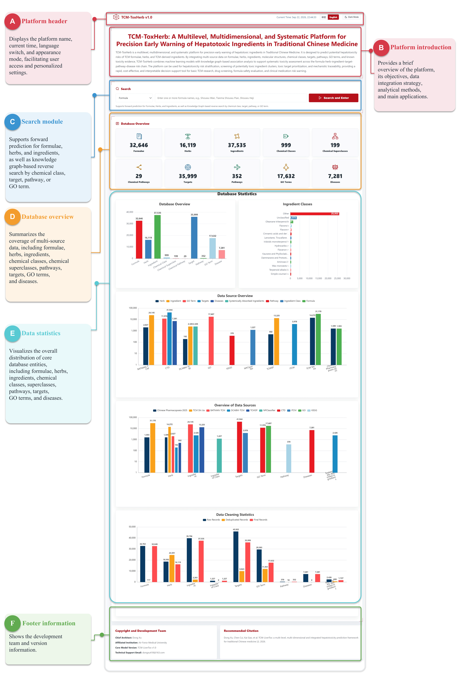
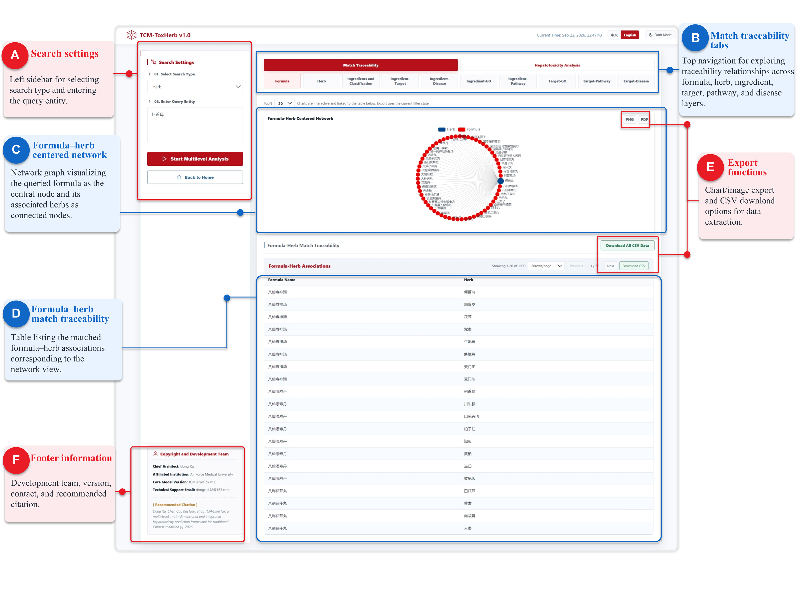
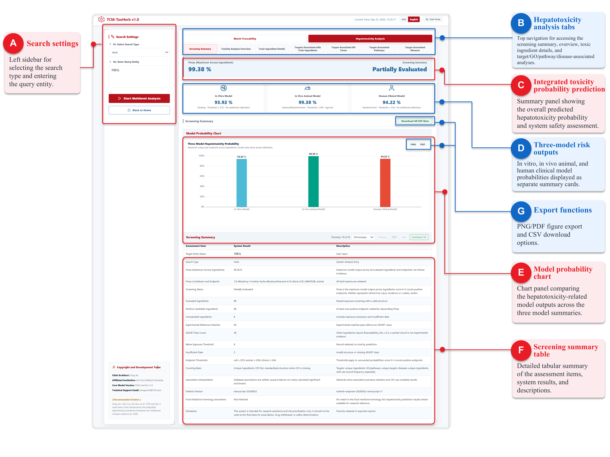

# TCM-LiverTox

> **Research software / 科研软件**
>
> 本仓库当前仅供未发表研究使用，保留所有权利，暂不授予开源许可。请勿在未经作者明确许可的情况下复制、公开或再分发。

TCM-LiverTox 是一个面向方剂、单味中药和中药来源化学成分的本地肝毒性预测与知识关联分析平台。系统由单页 Web 前端、FastAPI 后端、预测脚本、机器学习模型、本地数据资源和任务缓存模块组成。

## 软件介绍

点击图片可查看大图。

### 1. 软件首页与数据库总览

展示平台入口、检索功能、数据库概览及统计图表。

[](docs/images/figure-13.png)

### 2. 知识关联检索与来源追溯

展示方剂与中药的关联网络、来源追溯表及结果导出入口。

[](docs/images/figure-14.png)

### 3. 肝毒性预测与筛查摘要

展示三端点预测、模型概率图、筛查摘要及结果导出功能。

[](docs/images/figure-15.png)

## 重要声明

- 本软件仅用于科研、方法开发和结果探索，不构成医疗建议、临床诊断或用药决策依据。
- 预测结果必须由具备相关专业背景的研究人员结合实验与临床证据审慎解释。
- `data/` 中的数据清单标记为本地研究数据；在任何公开发布或第三方共享前，必须逐项核验上游来源、许可和引用要求。
- `models/` 中的模型文件及相关训练资源在公开发布前也必须完成权属和许可审查。

## 环境要求

- Windows 10/11
- Python 3.13（当前开发环境为 Python 3.13.3）
- Git 与 [Git LFS](https://git-lfs.com/)
- Node.js 20+ 和 npm（仅运行 Playwright 端到端测试时需要）

仓库包含约 1.17 GB 数据及 126 MB 模型。首次克隆前请确保 Git LFS 已安装，并预留足够的磁盘空间。

## 获取与运行

```powershell
git lfs install
git clone https://github.com/Super-dong94/TCM-LiverTox.git
Set-Location TCM-LiverTox

python -m venv .venv
.\.venv\Scripts\Activate.ps1
python -m pip install --upgrade pip
pip install -r requirements.txt

.\run.bat
```

程序启动后会选择一个可用的本地端口并自动打开浏览器。默认仅监听 `127.0.0.1`。

## 项目结构

```text
backend/              FastAPI 服务、任务管理、安全配置和预测封装
frontend/             单页 Web 界面及本地 ECharts 资源
prediction_scripts/   方剂、中药和化学成分预测流程
models/               训练后的模型与校准状态清单（Git LFS）
data/                 本地数据库、索引及关联数据（Git LFS）
scripts/              数据清单维护与本地冒烟测试脚本
tests/                Python 单元/集成测试与 Playwright 测试
main.py               本地应用入口
run.bat               Windows 启动脚本
build_exe.bat         Windows 可执行程序构建脚本
```

## 测试

运行 Python 测试：

```powershell
.\.venv\Scripts\python.exe -m pytest -q
```

运行端到端测试时，先在一个终端启动服务并固定端口：

```powershell
$env:TOXHERB_PORT = "7860"
.\.venv\Scripts\python.exe main.py
```

再在另一个终端执行：

```powershell
npm install --no-package-lock
npm run test:e2e
```

测试和日常运行生成的用户数据库、日志及预测结果均由 `.gitignore` 排除。

## 数据与模型完整性

`data_manifest.json` 记录数据文件的名称、大小、校验信息和许可提醒；`models/calibration/calibration_manifest.json` 记录模型校准状态。发布、归档或迁移仓库时应同时保留这些清单。

## 当前预测口径

当前方法版本为 `manuscript-20260922`。支持本地数据库可解析的方剂、中药和化学成分输入。

- 入血筛选：命中实测参考库直接通过；其他成分按预计算 ADMET 结果中的 `Bioavailability_Ma >= 0.3` 筛选。预计算表命中与实测证据分别记录，LogP、MW、QED 仅供查看。
- 结构处理：保留最大碎片、电荷中和并生成 canonical isomeric SMILES，保留原始 CID、结构和来源关系。
- 三个端点分别使用 Stacking、BalancedRandomForest 和 RandomForest，阳性阈值依次为 0.55、0.96 和 0.64。动物端点使用 sigmoid 校准，其余两个最终模型不附加额外校准。
- 评分：Pmax 为三个端点概率的最大值，综合分数为阳性端点数（0–3）。至少一个端点阳性即为候选成分，按 Pmax 降序排列；方剂和中药的 Pmax 为成分集合中的最大值。
- 无可评估成分时显示“无法评估”；缺失概率在 API 中为 null，在 CSV 中为空。模型输出不等同于临床肝损伤发生率或安全性结论。
- 成分以 CID 去重，缺失 CID 时使用标准化结构；靶标和疾病按唯一成分数统计，GO 和通路按唯一靶标数统计。原始关联记录频次单独保留，关联信息不代表因果证据或新计算的显著性富集。
- 页面使用完整后端统计，支持结果分页、分区 CSV 和全部 CSV 导出，保留 PNG/PDF 导出。新版缓存与旧口径隔离，历史结果标明旧版本。

数据验收：37,535 条入血筛选数据中，1,523 条实测匹配、31,506 条 ADMET 预测通过，共 33,029 条通过筛选。论文九成分示例全部通过，三端点阳性数为 7/9/8，综合分数为六个 3 分、三个 2 分。

本次更新复用现有训练模型；未重新训练模型，未重新打包 Windows exe。

## 权利声明与推荐引用

仓库公开可访问，但当前版本没有开源许可证，保留所有权利。论文发表并完成数据、模型及第三方组件许可审计后，再补充正式许可证和相关说明。

Dong Xu, Chen Cui, Kai Gao, et al. TCM-LiverTox: a multi-level, multi-dimensional and integrated hepatotoxicity prediction framework for traditional Chinese medicine [J]. 2026.

---

## English Summary

TCM-LiverTox is a local research platform for hepatotoxicity prediction and knowledge-association analysis across herbal formulas, individual herbs, and herb-derived compounds. It combines a FastAPI backend, a single-page web interface, prediction pipelines, trained machine-learning models, and local research datasets.

This publicly accessible repository contains research software. All rights are reserved and no open-source license is granted. The software is intended for research only and must not be used as a substitute for medical, diagnostic, or prescribing decisions. Dataset and model provenance, redistribution rights, and citation requirements must be reviewed before reuse or redistribution.
